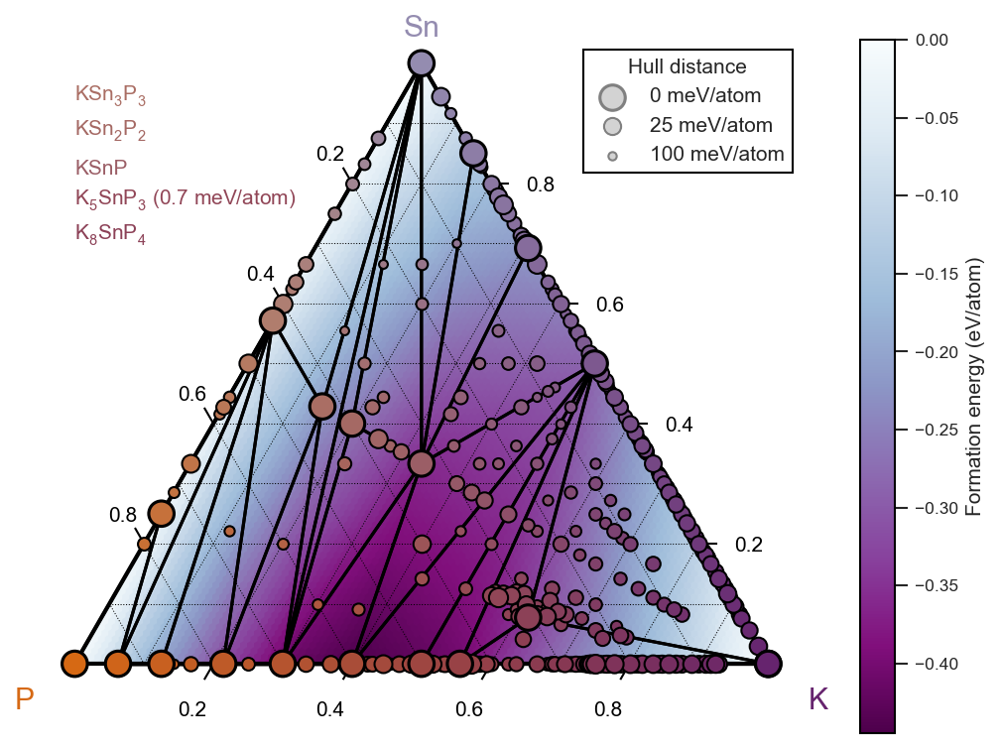

=======
matador
=======

| |PyPI Version| |GH Actions| |Binder|
| |Documentation Status| |MIT License| |Coverage Status|
| |JOSS| |Zenodo|

matador is an aggregator, manipulator and runner of first-principles calculations, written with a bent towards battery electrode materials.
The source can be found on `GitHub <https://github.com/ml-evs/matador>`_ and online documentation is hosted at `ReadTheDocs <https://docs.matador.science>`_.

Example Jupyter notebooks and tutorials can be found `online <https://docs.matador.science/en/latest/examples_index.html>`_ or in the ``examples/`` folder of the matador source code.

Written & maintained by `Matthew Evans <https://ml-evs.science>`_ (2016-).

Installation
------------

In the simplest case (e.g. you already have Python 3.7+ set up), ``pip install matador-db`` is sufficient to get up and running, preferably in a fresh virtual environment.

Upgrading to the latest version should be as simple as ``pip install -U matador-db``.

For an editable development installation, clone the source code from this repository and run ``pip install -e .`` from the matador folder. Tests can be run on your local machine with ``python -m unittest discover -v -b`` or simply with ``py.test`` after test dependencies have been installed with ``pip install .[test]``. In order to test CASTEP-running functionality, the tests will look for an MPI-enabled executable named ``castep`` on your ``$PATH``.

Further instructions can be found in the `Installation instructions <https://docs.matador.science/en/latest/install.html>`_.

Usage
------

``matador`` is primarily a Python *library* that can be used inside Python scripts/modules to create a custom workflow. There are, however, several command-line scripts bundled with ``matador`` itself. All of these scripts are listed under `CLI Usage <https://docs.matador.science/en/latest/cli.html>`_.

For basic command-line usage, please explore the help system for each command. Common workflows can be found inside ``examples/`` and in the `online docs <http://docs.matador.science/en/latest/examples_index.html>`_.

Please consult the full `Python API documentation <http://docs.matador.science/en/latest/modules.html>`_ for programmatic usage.

Core functionality
-------------------

The API has many features that can be explored in the examples and API documentation. As a summary, ``matador`` can be used for:

- Scraping of CASTEP (and Quantum Espresso) input/output files into flexible Python dictionaries/models.
- The creation and curation of MongoDB collections of geometry optimisation calculations, with a powerful querying CLI/API.
- Customisable, publication-ready plots for all models, e.g. phase diagrams, PDF, PXRD, voltage profiles, electronic/vibrational bandstructures etc.
- High-throughput geometry optimisations, electronic and vibrational properties using CASTEP (and Quantum Espresso) with ``run3``. Tested on several supercomputers. ``run3`` is designed primarily for simple workflows and offers little in the way of tools for creating complex workflows; if this is your use case, then check out some of the other codes listed below.
- Creation of phase diagrams and electrochemical voltage profiles from the results of DFT calculations.

This functionality is achieved by interfacing with much of the standard scientific Python stack (`NumPy <https://numpy.org>`_, `SciPy <https://scipy.org>`_, `matplotlib <https://matplotlib.org>`_), some more materials-specific packages (`spglib <https://github.com/atztogo/spglib/>`_, `SeeK-path <https://github.com/giovannipizzi/seekpath>`_, `periodictable <https://github.com/pkienzle/periodictable>`_) and other general packages (`pymongo <https://github.com/mongodb/mongo-python-driver>`_, `python-ternary <https://github.com/marcharper/python-ternary>`_, `numba <https://numba.org>`_).

Similar packages
----------------

This package is by no means unique in its functionality or goals. Below is a list of similar packages and an overview of where they overlap with ``matador``:

- `ASE <https://wiki.fysik.dtu.dk/ase/>`_: manipulation of structures, parsing and exporting files, running jobs and local databases with ``ase-db``. An interface is provided to ASE's ``Atoms`` object.
- `pymatgen <https://pymatgen.org>`_: similar to ASE, with a focus on the VASP DFT code. An interface is provided to pymatgen's ``Structure`` object. Local databases can be constructed with the `pymatgen-db <https://github.com/materialsproject/pymatgen-db>`_ add-on and high-throughput workflows are achieved with `Fireworks <https://github.com/materialsproject/fireworks>`_.
- `AiiDA <https://www.aiida.net>`_: high-throughput job running, provenance tracking and database storage for many simulation codes.
- `sumo <https://github.com/SMTG-UCL/sumo>`_ publication quality plotting, primarily for VASP but also with support for other codes.

If you think this list is outdated, incorrect or simply incomplete, then please raise an issue!

Citing matador
--------------

If you use matador in your work, we kindly ask that you cite

    Matthew L. Evans, Andrew J. Morris, *matador: a Python library for analysing, curating and performing high-throughput density-functional theory calculations* Journal of Open Source Software, 5(54), 2563 (2020)
    `10.21105/joss.02563 <https://doi.org/10.21105/joss.02563>`_

Source code archives for all versions above 0.9 can be found at Zenodo `DOI 10.5281/zenodo.3908573 <https://doi.org/10.5281/zenodo.3908573>`_.

.. |PyPI Version| image:: https://img.shields.io/pypi/v/matador-db?label=PyPI&logo=pypi
   :target: https://pypi.org/project/matador-db/
.. |GH Actions| image:: https://img.shields.io/github/actions/workflow/status/ml-evs/matador/ci.yml?branch=master
   :target: https://github.com/ml-evs/matador/actions?query=branch%3Amaster
.. |MIT License| image:: https://img.shields.io/badge/license-MIT-blue.svg
   :target: https://github.com/ml-evs/matador/blob/master/LICENSE
.. |Coverage Status| image:: https://img.shields.io/codecov/c/gh/ml-evs/matador/master?logo=codecov
   :target: https://codecov.io/gh/ml-evs/matador
.. |Documentation Status| image:: https://readthedocs.org/projects/matador-db/badge/?version=stable
   :target: https://matador-db.readthedocs.io/en/stable/?badge=stable
.. |Zenodo| image:: https://zenodo.org/badge/DOI/10.5281/zenodo.3908573.svg
   :target: https://doi.org/10.5281/zenodo.3908573
.. |Binder| image:: https://mybinder.org/badge_logo.svg
   :target: https://mybinder.org/v2/gh/ml-evs/matador/master?filepath=examples/interactive
.. |JOSS| image:: https://joss.theoj.org/papers/4d0eea9bea4362dec4cb6d62ebccc913/status.svg
   :target: https://joss.theoj.org/papers/4d0eea9bea4362dec4cb6d62ebccc913
