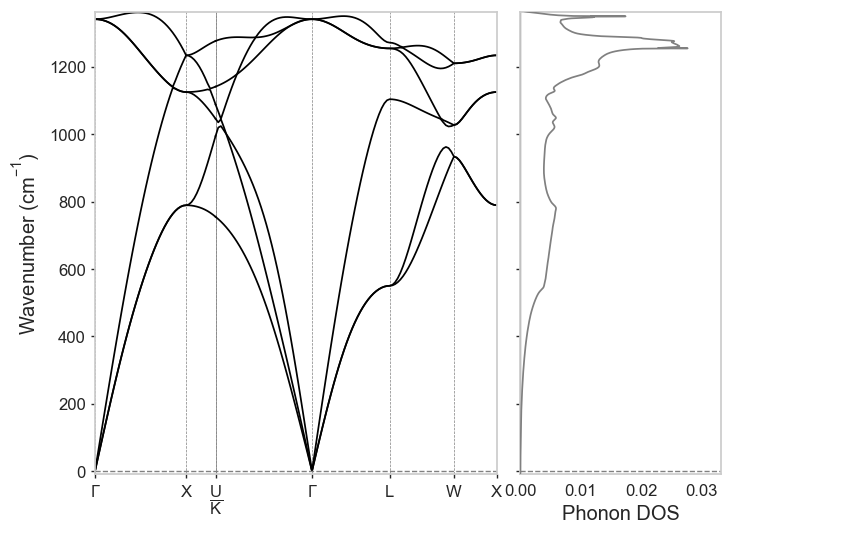

.. index:: run3_phonon

.. highlight:: bash

.. _run3_phonon:

Example 3: Phonon calculations with CASTEP and run3
-----------------------------------------------------

In this example, we will go from a crystal structure to phonon dispersion and DOS plot using run3 and CASTEP. As with electronic dispersion, run3 uses the `SeeK-path library <https://github.com/giovannipizzi/seekpath>`_ to generate standardised band paths through reciprocal space to automatically compute a useful dispersion for all crystal types.

Phonon calculations follow a similar procedure to the spectral calculations in Example 2: run3 expects to find a folder containing .res files with lattice/atomic position data, and one .cell and one .param file specifying the CASTEP options. Standard run3 rules apply: if a ``<seed>.res.lock`` file is found, or if the .res file is listed in ``jobs.txt``, the structure will be skipped. Such a folder can be found in ``examples/phonons/`` which contain structures of Si, Li and C. The Jupyter notebook ``phonon_results.ipynb`` will also show you exactly how to plot and analyse the results of the phonon calculations with the API. 

run3 will follow some simple rules to decide what kind of phonon calculation you want to run. First, it will check that ``task`` is set to ``phonon`` in the base param file. The workflow will then perform the following steps:

1. Relax the structure to the given ``geom_force_tol`` (which often needs to be very low for phonon calculations ~0.001 eV/A). If a ``.check`` file containing a relaxation is found, then this step is skipped.
2. From the structure/wavefunction found in the ``.check`` file computed in step 1 (or otherwise), compute the dynamical matrix with the given supercell/q-point spacing with CASTEP.
3. If ``phonon_fine_kpoint_path_spacing`` was specified in the base cell file (or a particular set of kpoints), then perform the dispersion calculation with CASTEP's built-in Fourier interpolation.
4. If ``phonon_fine_kpoint_mp_grid_spacing`` was specified in the base cell file, then perform a phonon DOS calculation with CASTEP's Fourier interpolation.

The output files will be cached in such a way that the ``.phonon`` file from the DOS calculation will not be overwritten by the other steps, and vice versa.

The specific example cell and param files will perform all of the above workflow steps: ::

   $ cat phonon.cell
   kpoints_mp_spacing: 0.07
   phonon_kpoints_mp_spacing: 0.1
   phonon_fine_kpoints_path_spacing: 0.05
   phonon_fine_kpoints_mp_spacing: 0.05
   snap_to_symmetry
   symmetry_tol: 0.01
   symmetry_generate
   %block species_pot
   QC5
   %endblock species_pot

   $ cat phonon.param
   task                          : phonon 
   phonon_method                 : finitedisplacement
   phonon_fine_method            : interpolate
   cut_off_energy                : 300.0 eV
   write_bib                     : False
   xc_functional                 : LDA
   geom_force_tol                : 0.05
   finite_basis_corr             : 0
   write_checkpoint              : none

The results can then be plotted with the ``dispersion`` script, if supplied with the ``-ph/--phonons`` flag, e.g. ::
   
   $ dispersion -ph completed/C

